Taste of Thayagam – Restaurant Ordering & Reservation System

A full-featured restaurant web application where customers can browse the menu, place online orders, make table reservations, and track delivery status. The system includes both a Customer Frontend and an Admin Panel for managing orders, menu items, and reservations.

Main Features

🔹 Customer Frontend
Browse menu items by category
Add dishes to cart
Place online food orders
Make table reservations
Real-time delivery status tracking
User-friendly, responsive UI

🔹 Admin Panel
Add / Edit / Delete menu items
Manage customer orders
Approve / reject reservations
Update delivery status (Preparing → Out for Delivery → Delivered)
Dashboard with quick stats

🔹 Basic API Integration
Your project includes simple JSON-based API simulation such as:
/api/menu.json – list of all menu items
/api/orders.json – order records
/api/reservations.json – reservation data
/api/delivery.json – tracking updates

Technologies Used

HTML5
CSS3
JavaScript
JSON (Mock API)
Bootstrap (optional)
LocalStorage / SessionStorage for cart & session handling

🚀 How to Run the Project
Download or clone the project folder
Make sure the folder structure remains the same
Open frontend/index.html in any browser
For admin features, open admin/admin.html
JSON files under /api will auto-load as API data

🔮 Future Enhancements
Integrate with real backend (Node.js / Firebase / PHP)
Add authentication for both users & admin
Add payment gateway (Card/QR)
Add live delivery map with markers
Push notifications for order updates

## Screenshots

###  Homepage
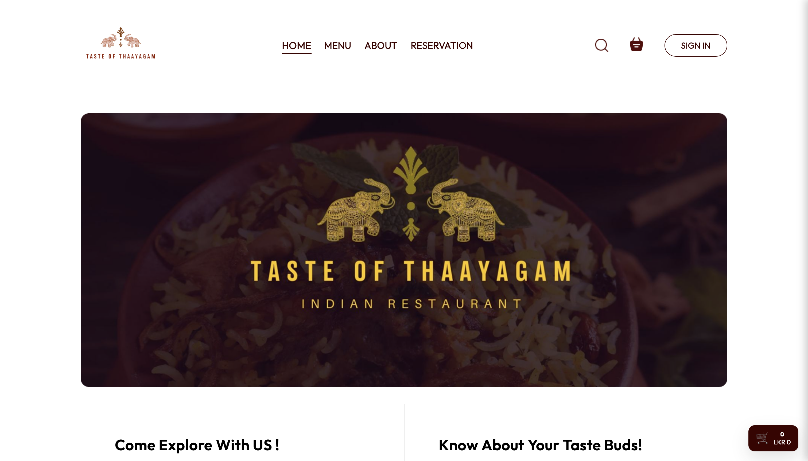

###  Menu Page
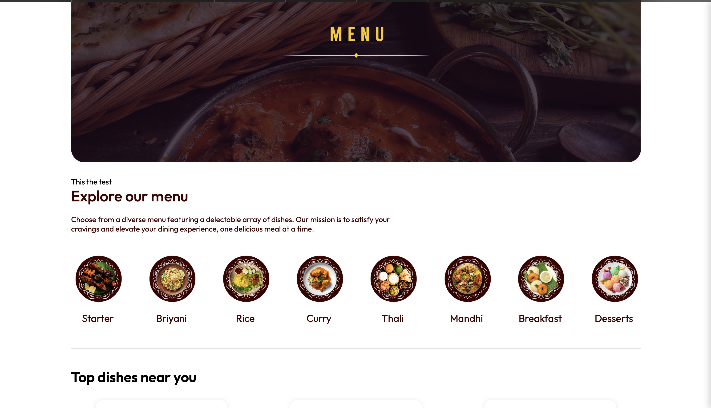

###  Menu List
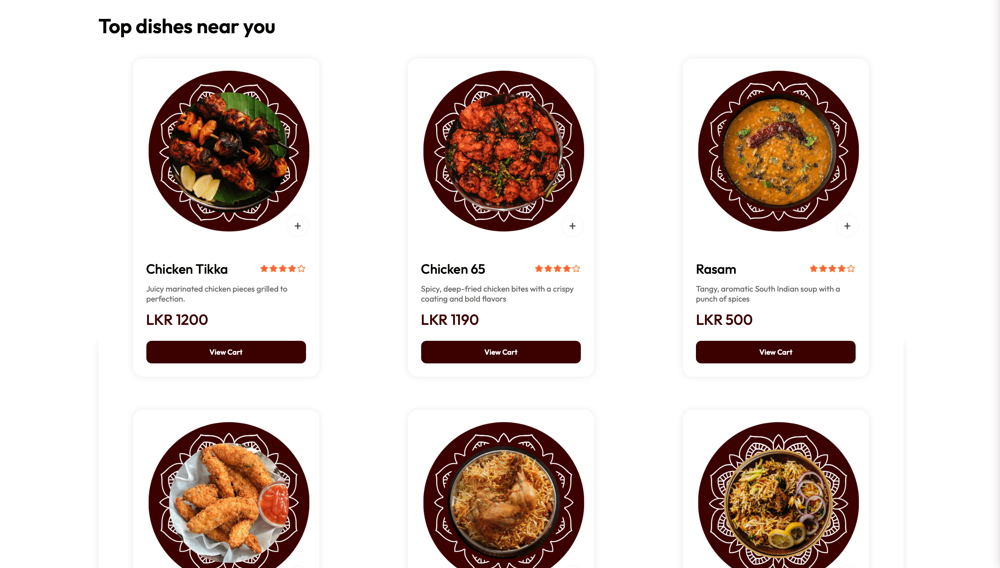

###  About Us

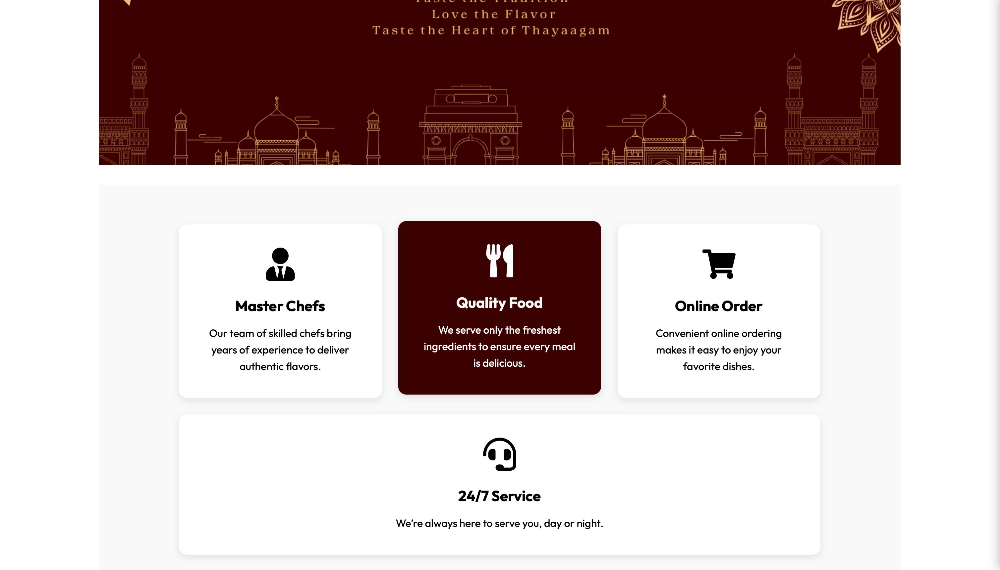

###  Contact Us
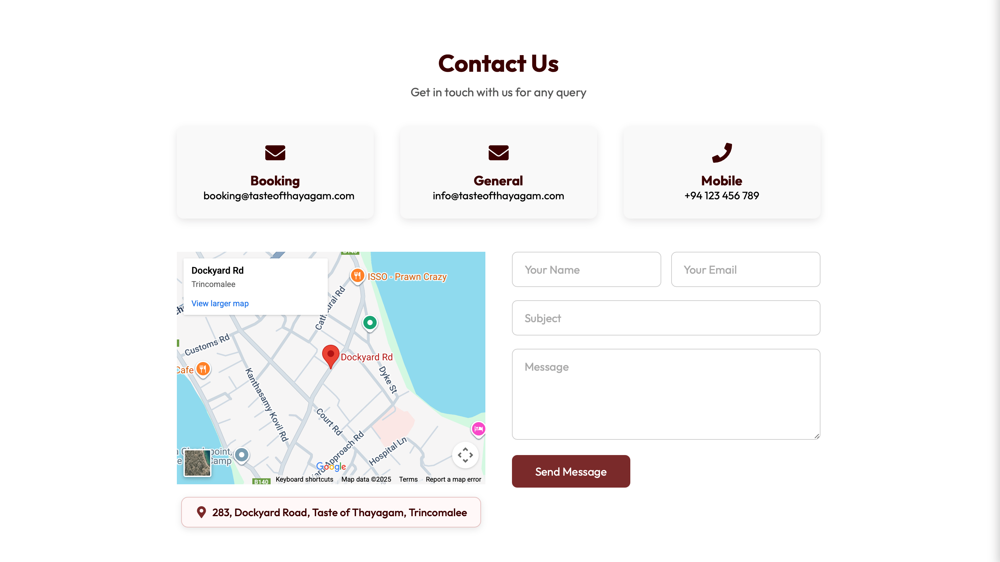

###  Cart
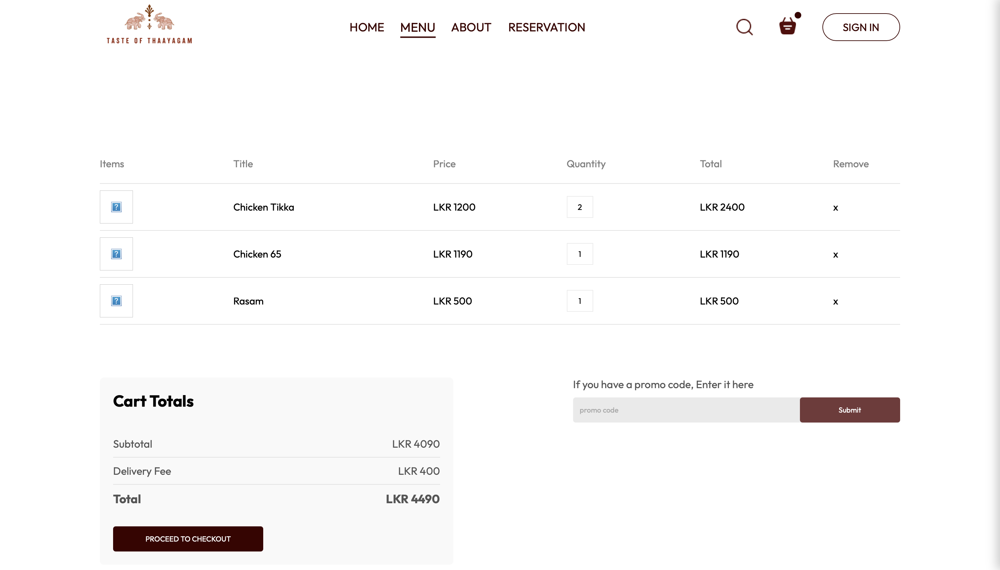

###  Reservation
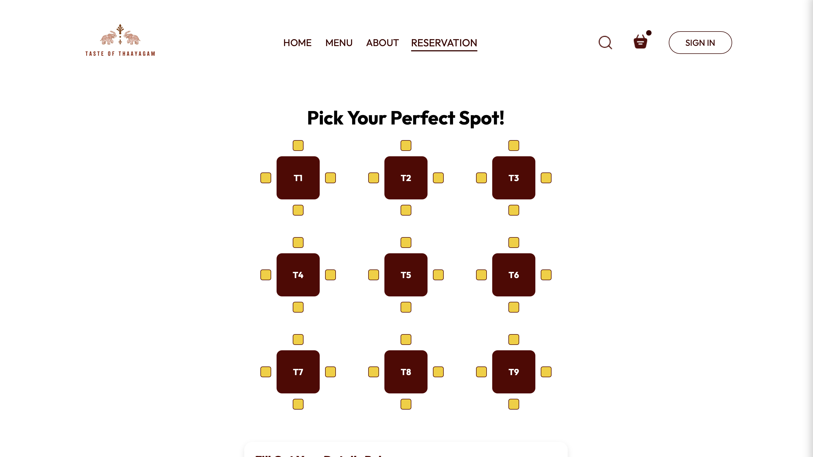

---

##  Admin Panel Screens

###  Admin Dashboard
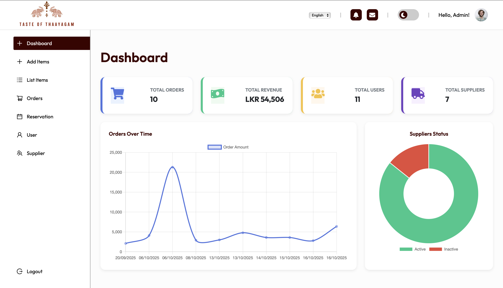

###  Add New Menu Item
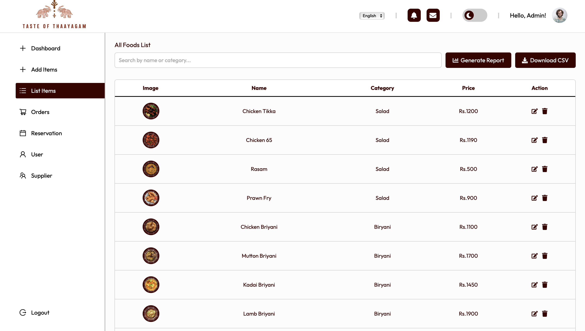

###  Menu List
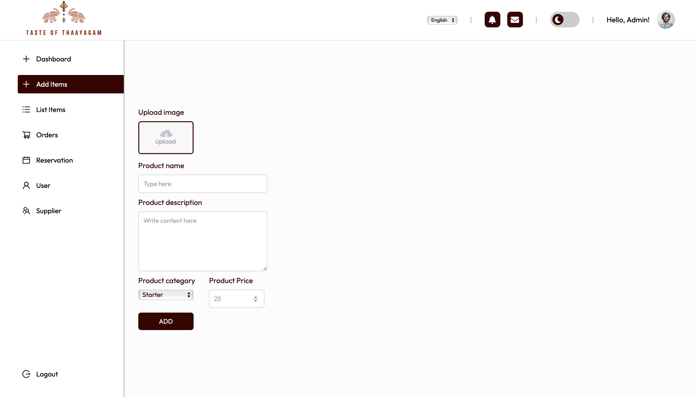

###  Orders
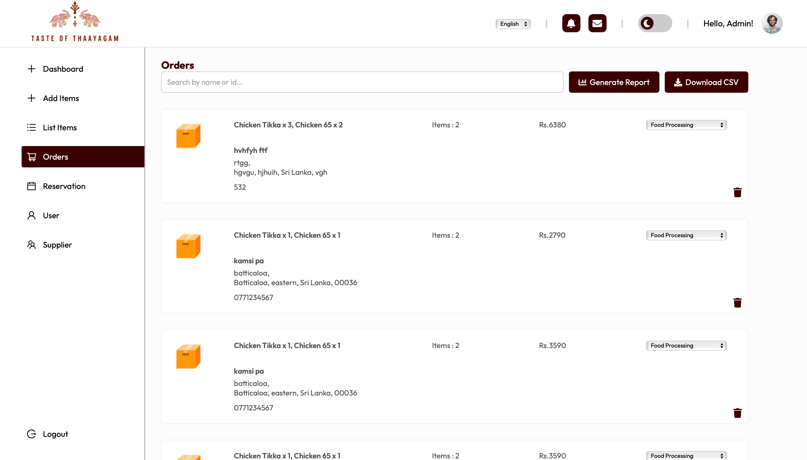

###  Dark Mode
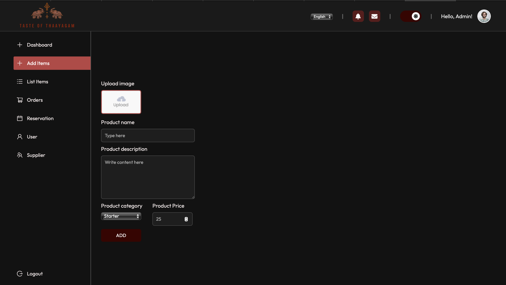
